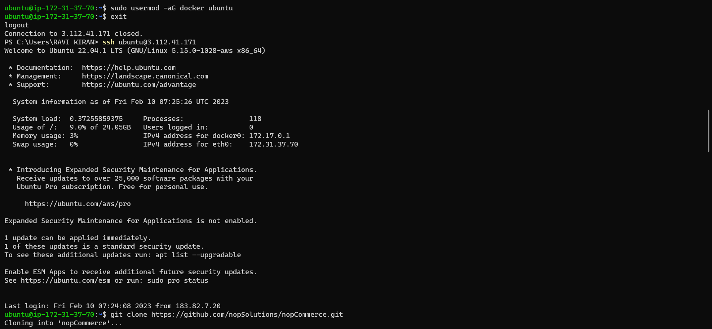
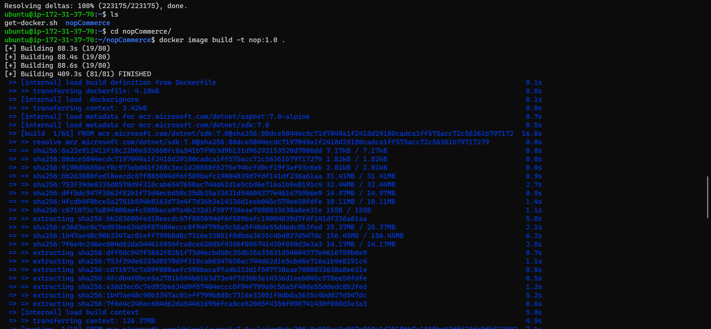
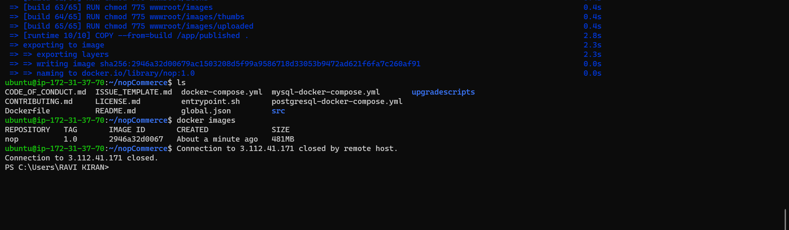

*BUILDING NOPCOMMERCE PROJECT.
-----------------------------


For Reference of Git hub Nopcommerce [REFERHERE](https://github.com/nopSolutions/nopCommerce).

** MANUAL STEPS

* Create Ec2 with Ubuntu= t2 large.

* Docker installation steps
````
Docker:

curl -fsSL https://get.docker.com -o get-docker.sh
sh get-docker.sh
sudo usermod -aG docker qtdevops
# exit
# relogin
docker info
````



* Build Steps For Docker Images
`````
git clone https://github.com/nopSolutions/nopCommerce.git
cd nopcommerce
docker image build -t nop:1.0 .
`````


