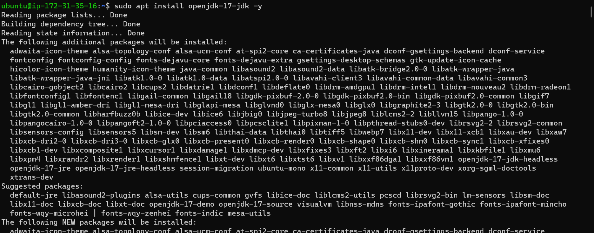
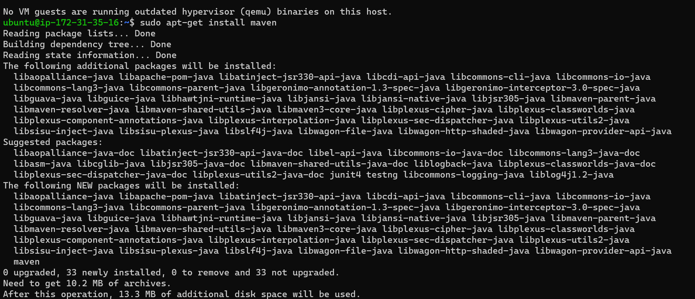
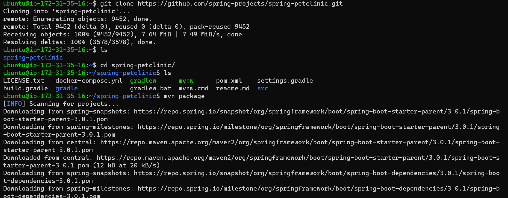
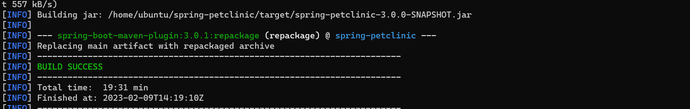
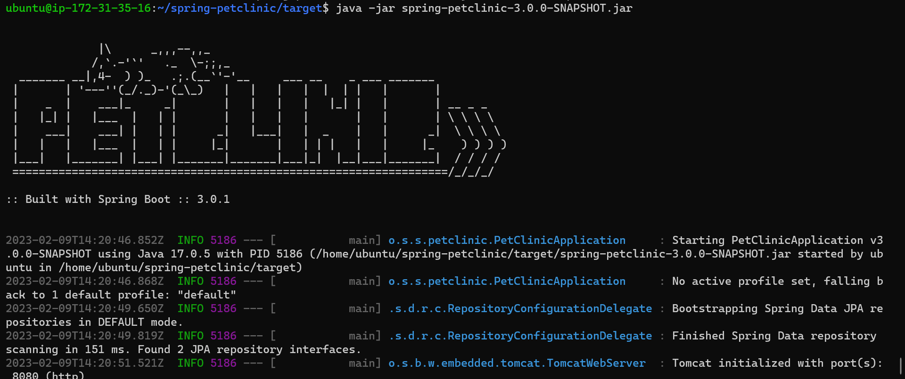
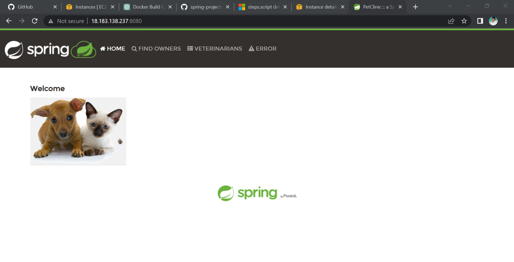

SPRING PETCLINIC
--------------------

* Manual steps
  * Before we start building project required below dependencies.
     * openjdk-17-jdk
     * maven
     * git

[referhere](https://github.com/spring-projects/spring-petclinic) for Spring-Petclinic Git repository.

`````
sudo apt update
sudo apt install openjdk-17-jdk maven -y
git clone https://github.com/spring-projects/spring-petclinic.git
cd spring-petclinic
mvn package
`````

* For installing java 17(sudo apt install openjdk-17-jdk)
 
*For installing maven (sudo apt install maven)
 
 *Cloing the git repository(git clone https://github.com/spring-projects/spring-petclinic.git)
 
* And changing the directory to Spring_petclinic
* Then (mvn package)
 
* It will Run the Process For 5 to 10 mints then it shows the build success or failed.


* After Build Success We will get a Target Folder Generated.
* changing the Directory To target folder and in that jar file will be Created (spring-petclinic-3.0.0-Snapshot.jar)
* we need to run the Command (java -jar spring-petclinic-3.0.0-Snapshot.jar )



* it will run the File By using our Localhost Ip:8080
* we can check in the browser.
.

